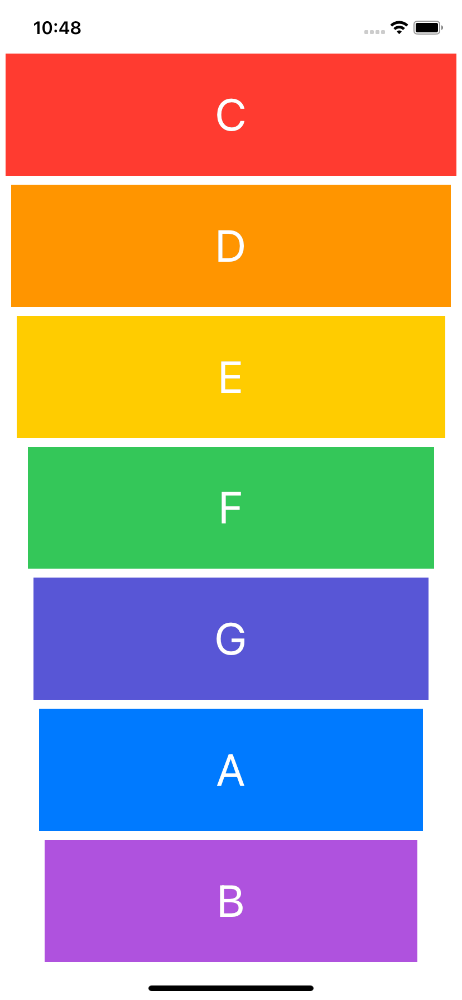

# Xylophone

## Our Goal

The goal is to play sound and use an Apple library called AVFoundation. The most important skill of a great programmer is being able to solve your own problems.

 Music apps are so popular on the App Store that they even get their own category.

## What I Learned in this module

* How to play sound using AVFoundation and AVAudioPlayer.
* Understand Apple documentation and how to use StackOverflow.
* Functions and methods in Swift.
* Data types.
* Swift loops.
* Variable scope.
* The ViewController lifecycle.
* Error handling in Swift.
* Code refactoring.
* Basic debugging.

## Screenshot 
 

